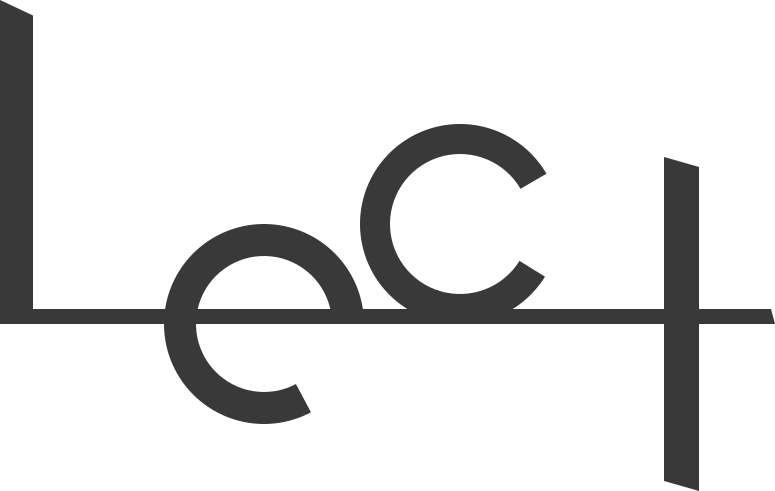
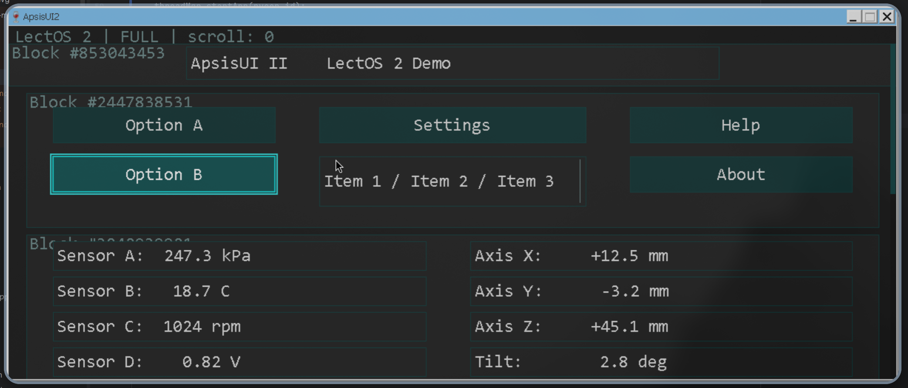
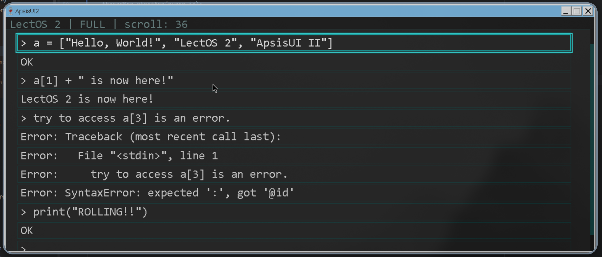

<a name="readme-top"></a>

<p align="center">
  
  &nbsp;&nbsp;&nbsp;&nbsp;&nbsp;&nbsp;&nbsp;&nbsp;
  
</p>

<h1 align="center">LectOS 2 | A rect-derived operating framework for CalXis</h1>

<p align="center">
  
  &nbsp;
  
  &nbsp;
  
  &nbsp;
  
  &nbsp;
  
</p>

<p align="center">
  A rect-derived operating framework for CalXis, an ESP32-S3 Based Axis Calculator.
  <br>
  Built around mechanical-axis computation, binary states, and a post-industrial visual language.
</p>

---

## Architecture

```
┌──────────────────────────────────────────────────────┐
│                   lui::app::Application              │
│  ┌─────────────────┐  ┌───────────────────────────┐  │
│  │   APP_NATIVE    │  │        APP_VM             │  │
│  │  (C++ compiled) │  │  (pocketpy Python 3.x)    │  │
│  └────────┬────────┘  └─────────────┬─────────────┘  │
│           └──────────┬──────────────┘                │
│                      ▼                               │
│              core::ThreadMgr                         │
│         (per-app std::thread, fg/bg arbitration)     │
├──────────────────────────────────────────────────────┤
│                 lui::scr::Screen                     │
│            (display target: W×H, color mode)         │
├──────────────────────────────────────────────────────┤
│                 lui::pge::Page                       │
│     ┌──────────────────────────────────────────┐     │
│     │  scroll_y / max_scroll / viewport_h      │     │
│     │  focus navigation (↑↓←→ geometry graph)  │     │
│     │  PAGE_FULL <-> PAGE_HALF height switch   │     │
│     └──────────────────────────────────────────┘     │
│  ┌────────────────────┐  ┌────────────────────────┐  │
│  │  lui::blk::Block   │  │  lui::blk::Block       │  │
│  │  ┌──────┐┌──────┐  │  │  ┌──────┐┌──────┐      │  │
│  │  │ Ele  ││ Ele  │  │  │  │ Ele  ││ Ele  │ ...  │  │
│  │  └──────┘└──────┘  │  │  └──────┘└──────┘      │  │
│  └────────────────────┘  └────────────────────────┘  │
│         lui::ele::Element (ELE_TEXTBOX / BUTTON      │
│                            / LIST / EMPTY)           │
├──────────────────────────────────────────────────────┤
│                   Service Layer                      │
│  ┌────────────┐ ┌───────────┐ ┌───────────────────┐  │
│  │  Render    │ │  Ctrller  │ │  Translator       │  │
│  │ (dual-queue│ │(keyboard  │ │  (drawPixelCmd,   │  │
│  │  rendering │ │ + analog  │ │   drawFontCmd,    │  │
│  │  + focus   │ │  switch)  │ │   drawLineCmd,    │  │
│  │  anim)     │ │           │ │   ClearDeviceCmd) │  │
│  └─────┬──────┘ └─────┬─────┘ └─────────┬─────────┘  │
│        └──────────────┼─────────────────┘            │
│                       ▼                              │
│              Platform Backend                        │
│     ┌──────────┐  ┌──────────┐  ┌──────────────┐     │
│     │ Linux 7  │  │ Windows  │  │  ESP32-S3    │     │
│     │ (Wine+   │  │ (EasyX)  │  │ (FreeRTOS+   │     │
│     │  EasyX)  │  │          │  │  ST7306 LCD) │     │
│     └──────────┘  └──────────┘  └──────────────┘     │
└──────────────────────────────────────────────────────┘
```

## Components

| Component | Description |
|-----------|-------------|
| **LectOS 2 Runtime** | Core OS framework managing app lifecycle, foreground arbitration, and service injection |
| **ApsisUI II Theme** | `lui::render::UIRenderApsisUI2` — layered render pipeline (bg → status bar → blocks → focus anim → scrollbar), dual-queue request system, easeOut focus transition animation |
| **Thread Manager** | `core::ThreadMgr` — per-application `std::thread` with register/start/stop/suspend/resume, foreground-background arbitration via `allow_input` / `allow_render` flags |
| **Native / VM Apps** | `APP_NATIVE` (C++ compiled into binary) and `APP_VM` (Python 3.x via pocketpy single-header interpreter) |
| **LUI Element Hierarchy** | Five-layer architecture: `Element` → `Block` → `Page` → `Screen` → `Application`, with logical (% 0–100) → physical (px) coordinate mapping |
| **Focus Navigation** | Geometry-based four-way focus graph auto-computed by `Page::recalculateFocus()` — O(n²) nearest-neighbor with horizontal/vertical overlap heuristics |
| **Bitmap Font Extension** | `lui::ext::font::FontBase` — transor-based pixel rendering of embedded bitmap glyphs (SarasaMonoSC 20px, 607 chars), no platform driver dependency |
| **Cross-platform Backend** | `lui::transor::TranslatorService` abstract interface with platform impls for Linux (Wine+EasyX), Windows (EasyX), ESP32-S3 (FreeRTOS+ST7306) |

## Platform

| Platform | Graphics | Notes |
|----------|----------|-------|
| **Linux** | EasyX via Wine | Primary dev host; `linux7` backend |
| **Windows** | EasyX native | MinGW-w64 cross-compilation from Linux |
| **ESP32-S3** | ST7306 LCD + FreeRTOS | Target hardware; 16-bit color depth |

## Build

```bash
# Configure (MinGW cross-compilation from Linux)
cmake -S . -B cmake-build-debug-mingw/ -G "MinGW Makefiles"

# Build
cmake --build cmake-build-debug-mingw/
```

---

> Btw, I created CalXis and LectOS entirely because of the confusing CASIO fx-991 calculator (LOL

## *Demo Screenshots

- Running on ArchLinux with WINE  
  <p align="left">
    
    &nbsp;&nbsp;&nbsp;&nbsp;
    
  </p>

- Running on ESP32-S3
  <p align="left">
    (ETA: 2000 yrs)
    &nbsp;&nbsp;&nbsp;&nbsp;
    Orz
  </p>

## *CalXis Repository

- Calculation core  
  
- Former OS edition  
  

---

<p align="right">
  
  &nbsp;&nbsp;
  
  &nbsp;&nbsp;
  <span> | LectOS 2 | ApsisUI Ⅱ | </span>
  <a href=#readme-top> Back to the top </a>
</p>
